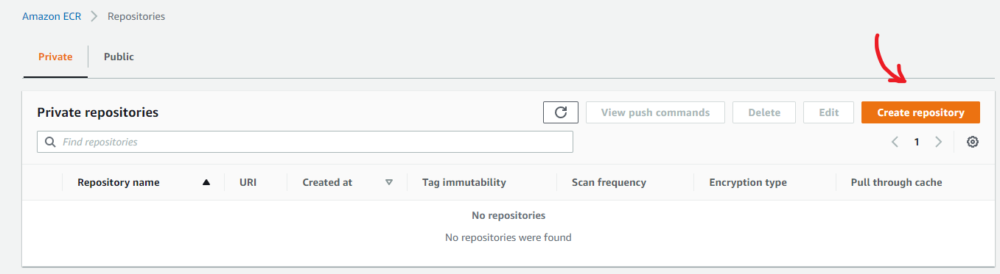
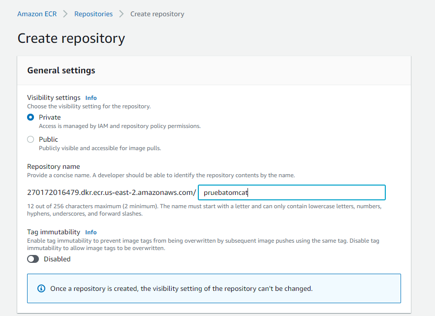
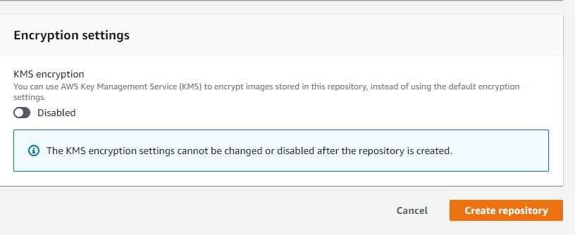
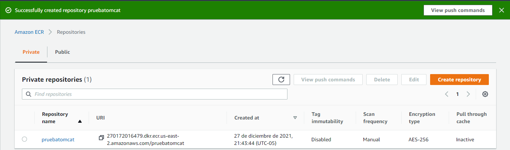
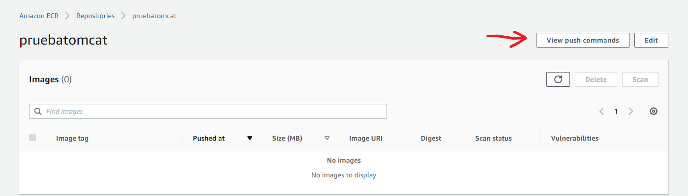
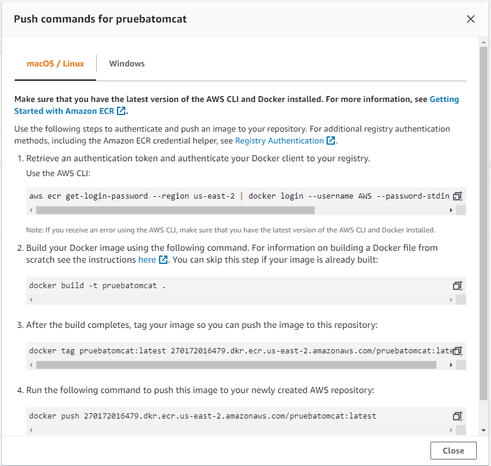
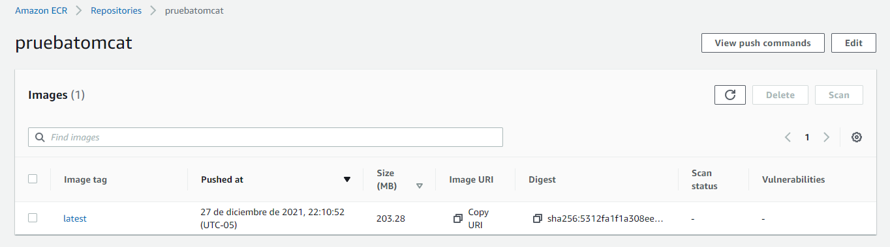

# Subiendo nuestro contenedor a ECR
Para comenzar a utilizar nuestras propias imagenes en AWS lo primero que tenemos que hacer es subirla a ECR, este servicio es el que nos ofrece amazon para subir nuestras propias imagenes a un repositorio publica o privado con el cual podemos disponer para utilizarlas en AWS.

1. Crear repositorio.

2. Escoger un nombre y si va a ser publico o privado.

3. Acontinuacion subiremos nuestra imagen al repositorio dandole click en view push comands.

4. Ejecutamos los comandos que se muestran.

5. Subimos nuestra imagen.

# Desplegar nuestro contenedor en ECS con EC2

1. Crear cluster de ECS.

