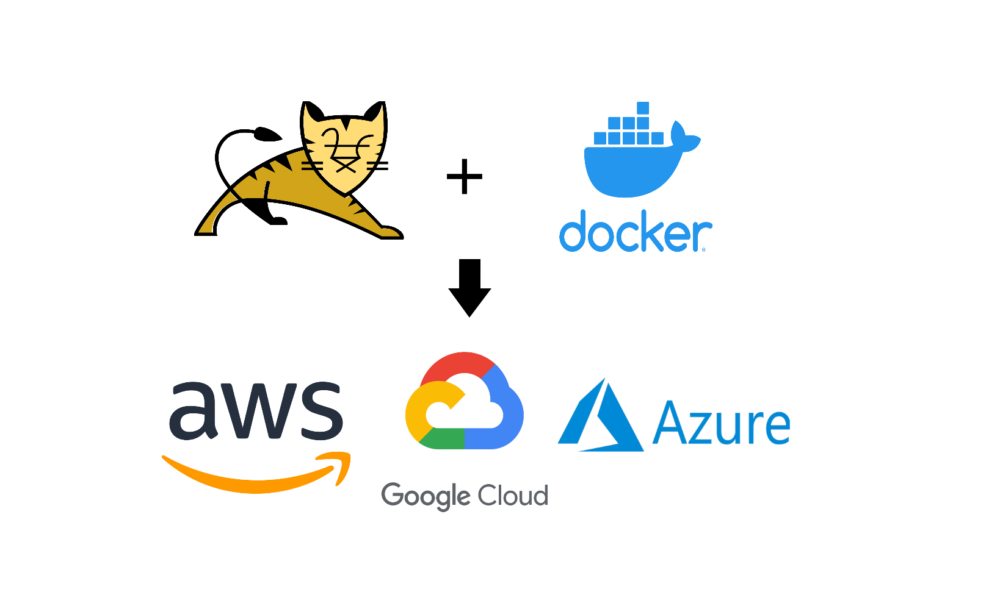

# TomcatDocker

En este repositorio se repasara como dockerizar el contenedor de servlets tomcat ademas de como desplegar este contenedor en 3 opciones en la nube como lo son AWS, Azure y Gcloud

## Docker

Docker es una plataforma de software que le permite crear, probar e implementar aplicaciones rápidamente. Docker empaqueta software en unidades estandarizadas llamadas contenedores que incluyen todo lo necesario para que el software se ejecute, incluidas bibliotecas, herramientas de sistema, código y tiempo de ejecución. Con Docker, puede implementar y ajustar la escala de aplicaciones rápidamente en cualquier entorno con la certeza de saber que su código se ejecutará.

## Contenedores vs Maquinas virtuales

Docker le proporciona una manera estándar de ejecutar su código. Docker es un sistema operativo para contenedores. De manera similar a cómo una máquina virtual virtualiza (elimina la necesidad de administrar directamente) el hardware del servidor, los contenedores virtualizan el sistema operativo de un servidor. Docker se instala en cada servidor y proporciona comandos sencillos que puede utilizar para crear, iniciar o detener contenedores.

Docker Engine se encarga de lanzar y gestionar los contenedores con nuestras aplicaciones, pero en lugar de exponer los diferentes recursos de hardware de la máquina de manera discreta (es decir, 1 procesador y "x" GB de RAM... para cada aplicación), lo que hace es compartirlos entre todos los contenedores optimizando su uso y eliminando la necesidad de tener sistemas operativos separados para conseguir el aislamiento.

